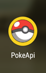
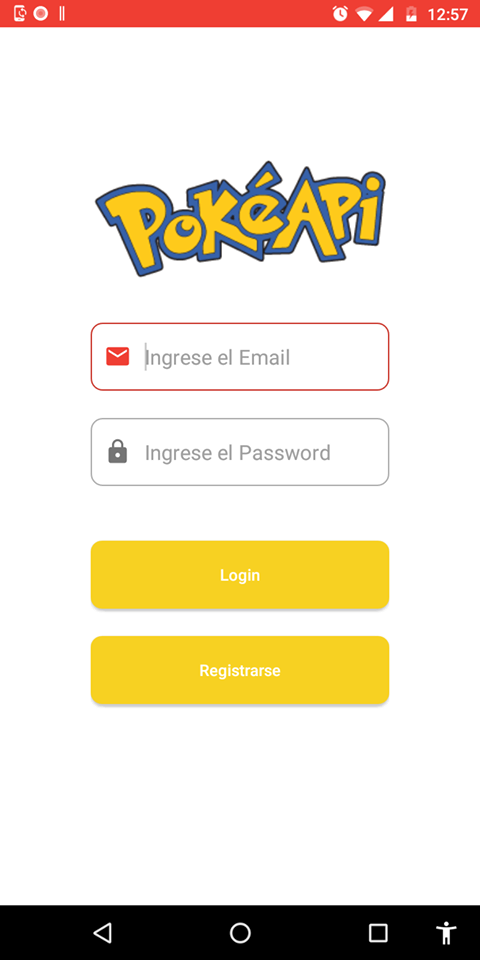

# Pokeapi
Prueba de proceso de selección en sunwise

Icon del la App en el telefono.

Para empezar a utlizar el proyecto lo primero que debes hacer es descargarlo, estos son los pasos para descargarlo.
1. Ejecuta Android Studio y debes estar en la ventana principal de Android Studio. (Si tienes algun proyecto abierto debes cerrarlo.)
1. Una vez que te encuentras en la ventana principal de Android Studio debes seleccionar la opcion **Get from Version Control**
1. Se abrirá una ventana.
1. En **Version control** debes seleccionar **Git**
1. En el **URL** ingresas el URL del repositorio https://github.com/alainpereida/Pokeapi [GitHub]
1. Y en **Directory** seleccionas el directorio donde lo quieras guardar en tu maquina.
1. Esperas a que termine la descarga y el edito de Android Studio se termine de abrir.

Una vez que el editor se termino de abrir, ya estas listo para ejectuar el proyecto. 

En la parte superior central se encuentra una barra de herramientas para ejecutar el proyecto, si no tienes un dispositivo vitual intalado puedes ejecutarlo en un 
dispositivo movil conectado a tu computadora. **Toma en cuenta que el software esta hecho para dispositivos con version de android 8.0.**

Una vez tengas una forma de ejecutar el proyecto debes seleccionarlo en la parte superior central. Seleccionas tu dispositivo conectado o la el dispotivo vitual.

Al ejecutar el proyecto el editor tardara unos segundos en instalarlo en tu dispostivo y lo ejecutara. 

Estos son lo usurios que tiene el software.
1. Alain Pereida Prado
   * alain.pereida@gmail.com
   * password
   
1. Angelica Perez
   * angelica.perez@hotmail.com
   * password

1. Jose Antonio Perez Trujillo
   * jose.perez@inc.com
   * password
   
1. Cesar Bernal
   * cesar.bernal@gmail.com
   * password
   
1. Jesus Delgado
   * jesus_98@gmail.com
   * password

1. Alfredo Fernandez
   * alfredo_10@hotmail.com
   * password

Imagenes del software terminado.

